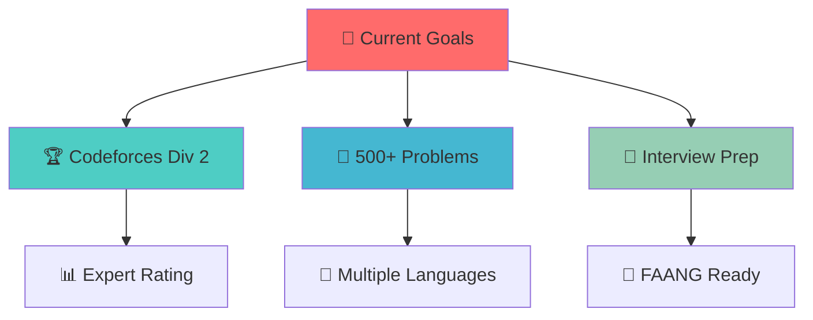

# 🧠 DSA Problem Solutions

<div align="center">
  


*A meticulously curated collection of my Data Structures & Algorithms journey*

**Platforms:** `LeetCode` • `Codeforces` • `CSES` • `CodeChef` • `And More`

[](https://github.com/username/repo/stargazers)
[](https://github.com/username/repo/network/members)

</div>

---


## 🎯 Problem Categories

<table align="center">
<tr>
<td align="center">

**🔢 Arrays & Strings**
<br>
*Mastering the fundamentals*
<br>


</td>
<td align="center">

**🎯 Two Pointers**
<br>
*Efficient dual traversal*
<br>


</td>
<td align="center">

**🪟 Sliding Window**
<br>
*Optimized range queries*
<br>


</td>
</tr>
<tr>
<td align="center">

**🔗 Linked Lists**
<br>
*Pointer manipulation*
<br>


</td>
<td align="center">

**📚 Stack & Queue**
<br>
*LIFO & FIFO operations*
<br>


</td>
<td align="center">

**🔍 Binary Search**
<br>
*Divide and conquer*
<br>


</td>
</tr>
<tr>
<td align="center">

**🌳 Trees & Graphs**
<br>
*Hierarchical structures*
<br>


</td>
<td align="center">

**💎 Dynamic Programming**
<br>
*Optimal substructure*
<br>


</td>
<td align="center">

**🎪 Greedy Algorithms**
<br>
*Local optimization*
<br>


</td>
</tr>
</table>

---

## 📊 Progress Dashboard

<div align="center">

### 🏆 Monthly Achievements

| 📅 **Month** | 🚀 **Platform** | 💯 **Problems Solved** | 📈 **Difficulty** |
|:---:|:---:|:---:|:---:|
| 🌟 **July 2025** | LeetCode • CSES | **45+** | Easy → Medium |
| 🔥 **August 2025** | Codeforces • CodeChef | **Coming Soon** | Medium → Hard |
| 🎯 **September 2025** | All Platforms | **Target: 100+** | Mixed Levels |

### 📈 Overall Statistics


</div>

---

## 🎯 Roadmap & Objectives

<div align="center">



</div>

**🎯 Short-term Goals:**
- 🔥 Achieve **Specialist** on Codeforces
- 📚 Complete **CSES Problem Set**
- 💼 Crack **internship interviews**

**🚀 Long-term Vision:**
- 🏆 Reach **Expert** rating on competitive platforms
- 📖 Master **advanced algorithms**
- 🎯 Join a **top-tier tech company**

---

## 👨‍💻 About The Developer

<div align="center">

### Hi, I'm **Sameer** 👋

*Passionate problem solver on a journey to master algorithms*

<table>
<tr>
<td align="center">

</td>
<td align="center">

</td>
</tr>
</table>

### 🌐 Connect With Me

[](https://leetcode.com/sameer)
[](https://codeforces.com/profile/sameer)
[](https://linkedin.com/in/sameer)
[](https://codechef.com/users/sameer)

</div>

---

## 🚀 Getting Started

### 📋 Prerequisites

```bash
# Languages Used
- C++ (Primary)
- Python (For specific problems)
- Java (Object-oriented solutions)
```

### 🔧 How to Use This Repository

1. **📖 Browse Solutions**
   ```bash
   git clone https://github.com/username/dsa-solutions.git
   cd dsa-solutions
   ```

2. **🍴 Fork & Customize**
   - Click the "Fork" button
   - Track your own progress
   - Add your solutions

3. **⭐ Star This Repo**
   - If you find it helpful
   - Support the project
   - Stay updated with new solutions

---

## 🤝 Contributing

Found a bug or have a better solution? Contributions are welcome!

1. 🍴 Fork the project
2. 🌿 Create your feature branch (`git checkout -b feature/AmazingSolution`)
3. 💾 Commit your changes (`git commit -m 'Add some AmazingSolution'`)
4. 📤 Push to the branch (`git push origin feature/AmazingSolution`)
5. 🔄 Open a Pull Request

---

## 📜 License

This project is licensed under the **MIT License** - see the [LICENSE](LICENSE) file for details.

---

<div align="center">

### 💭 *"The expert in anything was once a beginner."*

**⚡ Practice like you've never won. Perform like you've never lost. ⚡**

---

*Made with ❤️ by Sameer*


</div>
